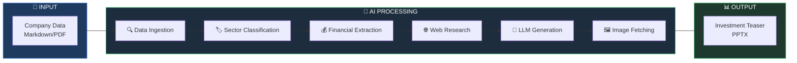
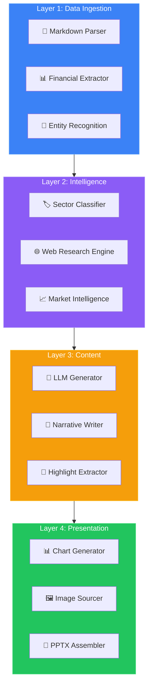
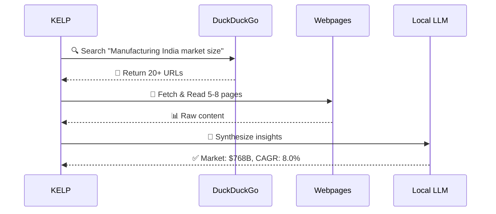

<!-- Animated Header -->
<p align="center">
  
</p>

<p align="center">
  
</p>

<!-- Animated Badges -->
<p align="center">
  <a href="#-quick-start"></a>
  <a href="#-architecture"></a>
  <a href="#-features"></a>
  <a href="#-tech-stack"></a>
</p>

<p align="center">
  
  
  
  
  
  
</p>

---

## 🎬 Demo

<p align="center">
  
</p>

<table align="center">
<tr>
<td align="center" width="50%">

### 📥 Input
```
📄 Company Markdown Files
├── Financial Reports
├── Business Description  
└── Product Information
```

</td>
<td align="center" width="50%">

### 📤 Output
```
📊 Investment Teaser PPT
├── Cover Slide
├── Business Overview
├── Financial Charts
└── Investment Highlights
```

</td>
</tr>
</table>

---

## 🎯 What is KELP?


**KELP** (Knowledge-Enhanced Lean Presentations) is an AI-powered pipeline that automatically generates professional **Investment Teaser PowerPoint presentations** from raw company data.

### ✨ Key Capabilities

| Feature | Description |
|:-------:|-------------|
| 📊 | **Dynamic Charts** - Donut, Area, Column, Gauge |
| 🔍 | **Web Research** - Real-time market intelligence |
| 🖼️ | **Smart Images** - Sector-specific auto-fetch |
| 🤖 | **Local LLM** - 100% offline, privacy-first |
| 📈 | **Market Data** - TAM, CAGR, Industry trends |

---

## 🏗️ Architecture

<p align="center">
  
</p>



### 🔄 Pipeline Flow



---

## 📁 Project Structure


```
🌿 KELP/
│
├── 📂 src/
│   ├── 📂 data_ingestion/        # Parse & extract
│   ├── 📂 sector_intelligence/   # ML classification
│   ├── 📂 content_generation/    # LLM narratives
│   ├── 📂 image_intelligence/    # Image sourcing
│   ├── 📂 presentation/          # PPTX generation
│   ├── 📂 citation/              # Source attribution
│   ├── 📂 web_scraping/          # Web data
│   └── 📂 vision/                # Visual AI
│
├── 📂 Company Data/              # 6 sample companies
├── 📂 config/                    # Settings
├── 📂 docs/                      # Documentation
│
├── 🐍 pipeline_v5_enhanced.py    # Main entry
├── 📋 requirements.txt           # Dependencies
└── 📖 README.md                  # You are here!
```

---

## ✨ Features

<p align="center">
  
</p>

### 🤖 AI-Powered Content Generation

<table>
<tr>
<td width="60%">

```python
# What KELP does with your data:

1. 🔍 Parse company markdown files
2. 🏷️ Classify into 6 industry sectors
3. 💰 Extract financial metrics (Revenue, EBITDA)
4. 🌐 Research market size & CAGR online
5. 🤖 Generate investor narratives via LLM
6. 📊 Create dynamic charts automatically
7. 🖼️ Fetch sector-relevant images
8. 📑 Assemble professional PPTX
```

</td>
<td width="40%" align="center">


</td>
</tr>
</table>

### 🌐 Gemini-Style Web Research



### 📊 Chart Types Generated

<table>
<tr>
<td align="center">🍩<br/><b>Donut</b><br/><sub>Revenue Split</sub></td>
<td align="center">📈<br/><b>Area</b><br/><sub>EBITDA Trend</sub></td>
<td align="center">📊<br/><b>Column</b><br/><sub>YoY Growth</sub></td>
<td align="center">📉<br/><b>Combo</b><br/><sub>Revenue+Margin</sub></td>
</tr>
<tr>
<td align="center">🎯<br/><b>Gauge</b><br/><sub>KPI Metrics</sub></td>
<td align="center">📶<br/><b>Stacked</b><br/><sub>Segments</sub></td>
<td align="center">📈<br/><b>Line</b><br/><sub>Trajectory</sub></td>
<td align="center">🥧<br/><b>Pie</b><br/><sub>Market Share</sub></td>
</tr>
</table>

---

## 🛠️ Tech Stack

<p align="center">
  
</p>

<table align="center">
<tr>
<td align="center" width="96">

<br>Python
</td>
<td align="center" width="96">

<br>PyTorch
</td>
<td align="center" width="96">

<br>Pandas
</td>
<td align="center" width="96">

<br>NumPy
</td>
<td align="center" width="96">

<br>Matplotlib
</td>
</tr>
</table>

### 🧠 AI & ML Stack

| Component | Technology | Purpose |
|:---------:|:----------:|---------|
| 🤖 | **Ollama + qwen2.5:7b** | Local LLM inference |
| 🔥 | **PyTorch 2.1+** | GPU acceleration |
| 🤗 | **Transformers** | Model loading |
| 🌐 | **ddgs** | Web search |
| 🍲 | **BeautifulSoup** | HTML parsing |

### 📊 Presentation Stack

| Component | Technology | Purpose |
|:---------:|:----------:|---------|
| 📑 | **python-pptx** | PPTX generation |
| 📈 | **Matplotlib** | Chart rendering |
| 🖼️ | **Pillow** | Image processing |
| 📄 | **pdfplumber** | PDF extraction |

### ⚙️ LLM Configuration

```python
GENERATION_CONFIG = {
    "model": "qwen2.5:7b",
    "temperature": 0.4,      # 🎯 Factual precision
    "top_p": 0.85,           # 📊 Balanced diversity  
    "repeat_penalty": 1.15,  # 🔄 Reduce repetition
    "num_ctx": 4096,         # 📖 Large context
}
```

---

## 🚀 Quick Start

<p align="center">
  
</p>

### 📋 Prerequisites

```bash
✅ Python 3.10+
✅ NVIDIA GPU (recommended) or CPU
✅ Ollama installed
```

### 📦 Installation

```bash
# Clone the repository
git clone https://github.com/shubro18202758/KELP.git
cd KELP

# Create virtual environment
python -m venv venv
venv\Scripts\activate     # Windows
source venv/bin/activate  # Linux/Mac

# Install dependencies
pip install -r requirements.txt

# Install LLM model
ollama pull qwen2.5:7b
```

### ▶️ Running KELP

```bash
# Process ALL companies
python pipeline_v5_enhanced.py

# Process SINGLE company
python pipeline_v5_enhanced.py --company kalyani

# Quiet mode
python pipeline_v5_enhanced.py --quiet
```

### 📺 Expected Output

```
======================================================================
🌿 KELP PIPELINE V5 - ENHANCED DATA-DENSE LAYOUTS
======================================================================

📦 Processing: FORGE
━━━━━━━━━━━━━━━━━━━━━━━━━━━━━━━━━━━━━━━━━━━━━━━
  ✓ Loaded 42,404 characters
  ✓ Sector: Manufacturing & Industrials (72%)
  ✓ Revenue: ₹2366Cr, EBITDA: 10.1%
  🔍 Found 22 sources, read 6 pages
  ✓ Market: $768.28B, CAGR: 8.0%
  ✓ Generated investment narratives
  ✓ Fetched 7 sector images
  📊 Created 5 slides with charts

✅ SUCCESS: Project Velocity
   📊 PPT: Project_Velocity_Manufacturing.pptx
   ⏱ Time: 54.0s
```

---

## 📊 Sample Results

<p align="center">
  
</p>

### 🏆 Companies Processed

| Company | Sector | Revenue | EBITDA | Market | CAGR |
|:--------|:-------|--------:|-------:|-------:|-----:|
| 🏭 Kalyani Forge | Manufacturing | ₹2,366 Cr | 10.1% | $768B | 8.0% |
| 🔌 Centum | Electronics | ₹11,554 Cr | 8.4% | $175B | 5.8% |
| 🎬 Connplex | Entertainment | ₹960 Cr | 27.3% | - | 9.8% |
| 🚚 Gati | Logistics | ₹15,100 Cr | 4.3% | $1.2B | 8.5% |
| 💊 Ind Swift | Pharma | ₹5,022 Cr | 9.7% | $129B | 8.1% |
| 💻 Ksolves | Technology | - | - | $166B | 13% |

### ⚡ Performance Metrics

```
┌─────────────────────────────────────────────────────────────┐
│                    PERFORMANCE DASHBOARD                     │
├─────────────────────────────────────────────────────────────┤
│  ⏱️  Processing Time     │  ~55 seconds per company         │
│  📄  Sources Found       │  20-25 per sector                │
│  📖  Pages Read          │  5-8 per company                 │
│  📊  Charts Generated    │  4-6 per presentation            │
│  🖼️  Images Fetched      │  7 per presentation              │
│  💾  VRAM Usage          │  ~4.4 GB (qwen2.5:7b)            │
└─────────────────────────────────────────────────────────────┘
```

---

## 🎨 Slide Preview

```
┌────────────────────────────────────────────────────────┐
│  SLIDE 1: COVER                                        │
│  ┌──────────────────────────────────────────────────┐  │
│  │     🏭                                           │  │
│  │     PROJECT VELOCITY                             │  │
│  │     Manufacturing & Industrials                  │  │
│  │     ━━━━━━━━━━━━━━━━━━━━━━                      │  │
│  │     Confidential Investment Teaser               │  │
│  └──────────────────────────────────────────────────┘  │
├────────────────────────────────────────────────────────┤
│  SLIDE 2: BUSINESS OVERVIEW (4-Quadrant)              │
│  ┌────────────────┬─────────────────────────────────┐  │
│  │  Description   │   Key Products                  │  │
│  ├────────────────┼─────────────────────────────────┤  │
│  │  Clients       │   Market Position               │  │
│  └────────────────┴─────────────────────────────────┘  │
├────────────────────────────────────────────────────────┤
│  SLIDE 3: FINANCIAL DEEP-DIVE                         │
│  ┌──────────┬──────────┬────────────────────────────┐  │
│  │  🍩      │  📈      │  Key Metrics               │  │
│  │  Revenue │  EBITDA  │  • Revenue: ₹2,366 Cr      │  │
│  │  Split   │  Trend   │  • EBITDA: 10.1%           │  │
│  └──────────┴──────────┴────────────────────────────┘  │
├────────────────────────────────────────────────────────┤
│  SLIDE 4: INVESTMENT HIGHLIGHTS                        │
│  ┌──────────────────────────────────────────────────┐  │
│  │  ✅ Strong market position                       │  │
│  │  ✅ Diversified client base                      │  │
│  │  ✅ Consistent revenue growth                    │  │
│  │  ✅ Expansion opportunities                      │  │
│  └──────────────────────────────────────────────────┘  │
└────────────────────────────────────────────────────────┘
```

---

## 💻 Hardware Tested

<table align="center">
<tr>
<td align="center">🎮<br/><b>GPU</b><br/>RTX 4070<br/><sub>8GB VRAM</sub></td>
<td align="center">🖥️<br/><b>CPU</b><br/>i9-14900HX<br/><sub>24 Cores</sub></td>
<td align="center">💾<br/><b>RAM</b><br/>32GB<br/><sub>DDR5</sub></td>
<td align="center">💿<br/><b>Storage</b><br/>NVMe<br/><sub>SSD</sub></td>
</tr>
</table>

---

## 🔮 Roadmap

<p align="center">
  
</p>

- [ ] 🌍 Multi-language support
- [ ] 📱 Streamlit web interface  
- [ ] 🔗 REST API endpoint
- [ ] 📊 More chart types (Waterfall, Sankey)
- [ ] 🤖 Fine-tuned domain LLM
- [ ] 📈 Real-time stock integration

---

## 🤝 Contributing

<p align="center">
  
</p>

Contributions are welcome! See [CONTRIBUTING.md](CONTRIBUTING.md) for guidelines.

```bash
# Fork → Clone → Branch → Commit → Push → PR
git checkout -b feature/amazing-feature
git commit -m "Add amazing feature"
git push origin feature/amazing-feature
```

---

## 📜 License

This project is licensed under the **MIT License** - see [LICENSE](LICENSE) for details.

---

## 🙏 Acknowledgments

<table align="center">
<tr>
<td align="center">🏆<br/><b>IIT Bombay</b><br/><sub>Hackathon 2026</sub></td>
<td align="center">🦙<br/><b>Ollama</b><br/><sub>Local LLM</sub></td>
<td align="center">📊<br/><b>python-pptx</b><br/><sub>PPTX Gen</sub></td>
<td align="center">🦆<br/><b>DuckDuckGo</b><br/><sub>Web Search</sub></td>
</tr>
</table>

---

<p align="center">
  
</p>

<p align="center">
  <b>Built with 💚 by Team KELP for IIT Bombay Hackathon 2026</b>
</p>

<p align="center">
  <a href="https://github.com/shubro18202758/KELP/stargazers">⭐ Star this repo</a> •
  <a href="https://github.com/shubro18202758/KELP/issues">🐛 Report Bug</a> •
  <a href="https://github.com/shubro18202758/KELP/issues">💡 Request Feature</a>
</p>

<p align="center">
  
</p>
